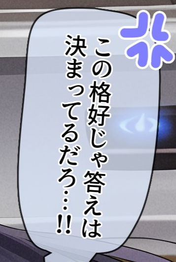
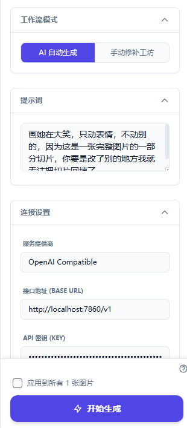
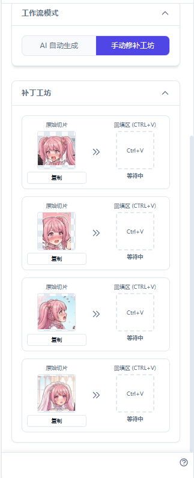
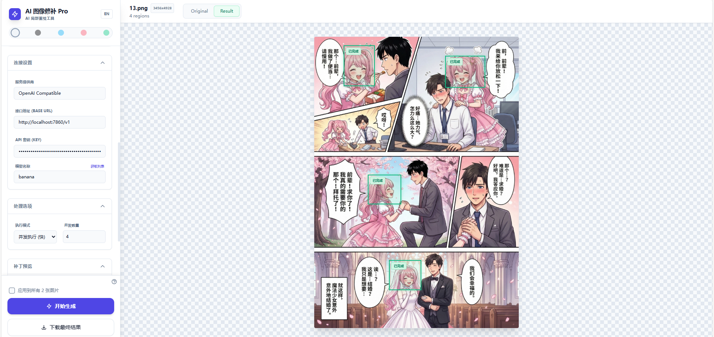

# 🎨 GenAI Patcher Pro (AI 智能修补工具)

**GenAI Patcher Pro** 是一个基于 Web 的专业 AI 图像局部重绘工具。

它允许用户在图片上框选特定区域，利用 Google Gemini 或 OpenAI (及兼容接口) 的多模态能力，根据文本提示词对该区域进行修改、增强或替换，并自动将生成的补丁无缝合成回原图。

无论是去除水印、修改细节、批量编辑，还是通过局部框选绕过 AI 模型的安全过滤实现漫画翻译，这个工具都能轻松胜任。


## ✨ 核心功能

*   **🎯 精准局部编辑**：在画布上自由框选（支持多个区域），仅修改选中部分，保持原图其他部分不变。
*   **⚡ 批量自动化处理**：
    *   支持**文件夹上传**，一次处理数百张图片。
    *   **"应用到所有"** 功能：在一张图上设定好选区和提示词，一键应用到列表中的所有图片（非常适合处理连贯的视频帧或相同布局的截图）。
*   **🤖 多模型支持**：
    *   **Google Gemini**：原生支持 `gemini-2.5-flash-image`, `gemini-3-pro-image-preview` 等模型。
    *   **OpenAI 兼容模式**：支持 GPT-4o，或任何兼容 OpenAI 视觉接口的 API（如本地部署的 vLLM、Ollama 等）。
*   **🚀 并发控制**：支持**并发 (Concurrent)** 或 **串行 (Serial)** 执行模式，通过控制并发数来平衡生成速度与 API 速率限制。
*   **🎨 现代化 UI/UX**：
    *   **5 种精美主题**：Light (默认), Dark (夜间), Ocean (蓝), Rose (粉), Forest (绿)。
    *   **中英文国际化**：内置一键语言切换。
    *   **实时预览与对比**：一键切换 "原始图" 与 "结果图"。
*   **📦 便捷导出**：支持单张下载或将所有处理结果打包为 **ZIP** 下载。

## 🎬 典型应用场景

### 场景一：漫画翻译（突破 AI 安全过滤）

这是一个利用局部重绘功能的创新应用。我们都知道 banana 可以翻译正常漫画，但对于某些漫画内容会因为安全过滤而拒绝处理（比如大人爱看的漫画w）。

**解决方案**：只框选文本区域发送给 AI，避免将完整图片触发安全过滤机制！

**漫画翻译工作流**

**步骤 1：上传图片**
点击左侧边栏的 "文件" 或 "文件夹" 图标上传漫画图片。支持直接 `Ctrl+V` 粘贴剪贴板图片。
点击 "文件夹上传" 可以批量把图片上传。
    

**步骤 2：框选文本区域**
在画布上按住鼠标左键拖动，圈出包含日文台词的区域。



> 💡 **重要提示1**：圈选时不要只圈文本框，要多截一些周围的景色！因为测试发现，如果不截取背景，AI 可能会偷懒不嵌字，直接把日文原图发回来。

> 💡 **重要提示2**：虽然要多圈一点，但是也不能圈太多景色，如上图一样只多圈一点点就行了。如果圈太多，那么banana就要有自己的想法了……

**步骤 3：输入翻译提示词**
在左侧 "提示词" 文本框中，输入以下提示词（可根据需要修改）：

```
0. 使用banana pro

1. 请用banana中文翻译替换掉图片里的日文。是的，生成一张只有中文的图！

3. 这句台词的大意是：[]
```

**步骤 4：配置 API**

展开 "连接设置" (Connection Settings)，选择 **Provider** (推荐使用 Gemini)，输入你的 **API Key**。



**步骤 5：开始翻译**
点击 "开始生成"，AI 会自动翻译并将中文文本无缝嵌回原图！

当然你也可以使用手动模式：



**步骤 6：查看与下载**
生成完成后，右上角切换 "Result" 查看效果，点击 "下载最终结果" 保存图片。


**批量翻译**：勾选 **"应用到所有图片"** 后点击 **"批量生成所有"**，只需设置一次选区和提示词，就能应用到所有图片（非常适合处理连贯的漫画页面）。


### 场景二：图片后期编辑

*   **去除水印**：圈选水印区域，提示词"去除水印，保持背景自然"
*   **修改细节**：调整表情、改变发色、添加配饰等
*   **场景修改**：将白天改为夜晚、将晴天改为雨天等
*   **对象替换**：替换图片中的特定元素

### 场景三：批量处理

处理数百张格式相同或需要统一修改的图片时：
1. 上传文件夹
2. 在一张图上设置好选区和提示词
3. 勾选"应用到所有图片"
4. 批量生成

## 🛠️ 使用指南

### 启动项目
确保你已经安装了 Node.js 环境。
```bash
npm install
npm run dev
```

### 基本操作流程

1.  **上传图片**：点击左侧边栏的 "文件" 或 "文件夹" 图标上传图片。支持直接 `Ctrl+V` 粘贴剪贴板图片。

2.  **绘制选区**：
    *   在中间的画布上，按住鼠标左键拖动，框选你想要 AI 修改的区域。
    *   可以绘制多个不重叠的区域。

    

    

3.  **输入提示词 (Prompt)**：在左侧 "提示词" 文本框中，描述你希望选区变成什么样。例如："去除这里的水印"、"把天空变成星空"、"戴上一副墨镜"。

4.  **配置 API**：展开 "连接设置"，选择 Provider，输入 API Key。

5.  **开始生成**：单张处理点击 "开始生成"，批量处理勾选 "应用到所有图片" 后点击 "批量生成所有"。

6.  **查看与下载**：生成完成后，右上角切换 "Result" 查看效果，下载单张或打包下载。

## ⚙️ API 配置说明

本项目完全运行在浏览器端，**API Key 仅保存在你的本地浏览器 (localStorage)**，不会上传到任何第三方服务器。

### Google Gemini
*   **API Key**: 前往 [Google AI Studio](https://aistudio.google.com/) 获取。

### OpenAI / 兼容接口
*   **Base URL**: 默认为 `https://api.openai.com/v1`。如果你使用的是中转服务或本地模型，请修改此地址。
*   **API Key**: 你的 OpenAI 格式密钥 (`sk-...`)。

## 💻 技术栈

*   **Frontend Framework**: React 19 (Hooks, Functional Components)
*   **Styling**: Tailwind CSS (利用 CSS Variables 实现动态换肤)
*   **AI SDK**: `@google/genai` (官方 SDK)
*   **Utilities**: `jszip` (压缩下载), `file-saver` (文件保存)

## ❓ 常见问题

**Q: 为什么生成的区域看起来和原图不融合？**
A: 这取决于提示词和模型的能力。告诉模型这是一张大图的切片，并在提示词中加入 "seamless blend" (无缝融合), "match lighting" (匹配光照) 等词汇。

**Q: 批量处理时为什么有的成功有的失败？**
A: 可能是触发了 API 的速率限制 (Rate Limit)。尝试在 "处理选项" 中将模式改为 "串行 (Serial)" 或降低 "并发数量"。

**Q: Gemini 报错 "Safety Filters"？**
A: Google 的模型有较为严格的安全过滤。如果你的原图或生成的图包含敏感内容，API 可能会拒绝生成。

## 🔮 未来计划

*   **自动检测文本框**：集成 comic text detector，自动识别漫画中的文本框，省去手动框选的步骤。（等一个 PR~）
